<!-- ============================================================
     SHIVAM SONI — GitHub Profile README
     Repository: github.com/sonishivam1/sonishivam1
     ============================================================ -->

<!-- ░░ LIQUID WAVE HEADER ░░ -->


<!-- ░░ ANIMATED TYPING ░░ -->
<p align="center">
  <a href="https://git.io/typing-svg">
    
  </a>
</p>

<!-- ░░ SOCIAL BADGES ░░ -->
<p align="center">
  <a href="https://www.linkedin.com/in/shivam-sonii/" target="_blank">
    
  </a>&nbsp;
  <a href="https://github.com/sonishivam1" target="_blank">
    
  </a>&nbsp;
  &nbsp;
  
</p>

<br/>

---

<!-- ░░ ABOUT ME — LIQUID GLASS CARD (generated SVG in /assets) ░░ -->
<p align="center">
  
</p>

<details>
<summary><b>View as code</b></summary>

```typescript
const shivam: Developer = {
  name:    "Shivam Soni",
  role:    "Full-Stack Engineer",
  company: "@CustomerSAX / Royal Cyber",
  location: "Prayagraj, India",

  building: [
    "Royal Cyber CSA — Customer Service Accelerator",
    "Multi-tenant Commerce Data Orchestration Platform",
    "AI-powered enterprise tooling",
  ],

  stack: {
    frontend:  ["Next.js 14", "React", "TypeScript", "TailwindCSS"],
    backend:   ["Node.js", "tRPC", "REST / GraphQL"],
    commerce:  ["commercetools", "Shopify Plus", "BigCommerce", "Adobe Commerce"],
    ai:        ["Claude API", "LLM Agents", "Autonomous Workflows"],
    infra:     ["Vercel Edge", "Docker", "PostgreSQL", "Redis"],
  },

  currentFocus: "Unifying commerce, CRM, OMS & ERP into one intelligent workspace",
  contact:      "linkedin.com/in/shivam-sonii",
};
```

</details>

<br/>

---

<!-- ░░ STATS ░░ -->
<h2 align="center">📊 GitHub Stats</h2>

<div align="center">
  
  &nbsp;&nbsp;
  
</div>

<br/>

<!-- STREAK STATS -->
<div align="center">
  
</div>

<br/>

---

<!-- ░░ TECH STACK ░░ -->
<h2 align="center">⚡ Tech Stack</h2>

<p align="center">
  <br/><br/>
  
</p>

<br/>

---

<!-- ░░ FEATURED PROJECT ░░ -->
<h2 align="center">🚀 Featured Project</h2>

<div align="center">
  <a href="https://github.com/sonishivam1/commerce-orchestrator">
    
  </a>
</div>

<br/>

---

<!-- ░░ ACTIVITY GRAPH ░░ -->
<h2 align="center">📈 Contribution Activity</h2>

<p align="center">
  
</p>

<br/>

---

<!-- ░░ SNAKE ANIMATION — requires GitHub Actions workflow (see setup below) ░░ -->
<div align="center">
  <picture>
    <source media="(prefers-color-scheme: dark)" srcset="https://raw.githubusercontent.com/sonishivam1/sonishivam1/output/github-contribution-grid-snake-dark.svg" />
    <source media="(prefers-color-scheme: light)" srcset="https://raw.githubusercontent.com/sonishivam1/sonishivam1/output/github-contribution-grid-snake.svg" />
    
  </picture>
</div>

<br/>

<!-- ░░ LIQUID WAVE FOOTER ░░ -->

